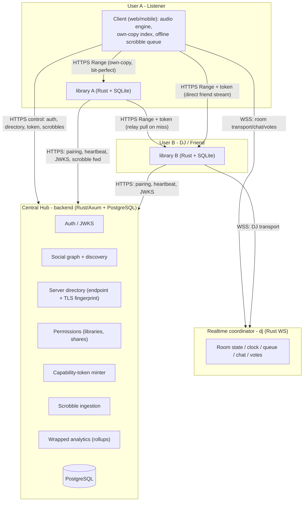

# Chordia - System Architecture

Canonical architecture reference for the Chordia ecosystem. Implementation lives in the six
component repos; this document explains how they fit together.

## 1. Topology

Two planes:

- **Control plane (Hub):** identity, social graph, server directory, permission checks,
  capability-token minting, WS room coordination, scrobble persistence. Metadata-only.
- **Data plane (direct):** raw audio over HTTPS Range, client→library or library→library,
  authorized by a Hub-signed capability token + TLS-fingerprint pinning. **Audio never
  transits the Hub.**

## 2. Security model: capability tokens

The **capability token** is the linchpin. It's a short-lived JWT signed by the Hub, scoped to
`(subject_user, target_library, resource, action, expiry)`. The Library validates it **offline**
against the Hub's published JWKS (`/.well-known/jwks.json`), with no per-request call to the Hub.

- **Streaming token:** authorizes `subject_user` to read `resource` (track/album/library) from a
  specific library. Minted only after the Hub checks `friendships` + `library_shares`.
- **Relay token:** `subject = listener's library`, `audience = DJ's library`, scoped to a track +
  `room_id`, short expiry. Lets the listener's library pull from the DJ's library.
- **TLS-fingerprint pinning:** libraries advertise their cert fingerprint to the Hub directory at
  pairing/heartbeat. Clients fetch the fingerprint from the directory and pin it, so self-signed
  certs are safe against MITM.

## 3. Audio architecture

### Bit-perfect (default `Original` tier)
HTTP **Range** requests (RFC 7233) over HTTP/2. Original file bytes are streamed unaltered, with
no decode or re-encode, and with `Accept-Ranges: bytes`, correct `Content-Type` (`audio/flac`,
`audio/mp4`, `audio/wav`), strong `ETag`, `Content-Length`. Byte-identity is client-verifiable
via the file content hash. No HLS for lossless (segmenting risks bitstream rewrites).

### Listener-controlled tiers + smart auto-downgrade
Tiers: `Original` (lossless passthrough) · `High` (~256k) · `Normal` (~128k) · `DataSaver`
(~96k Opus). Per-network-class defaults (Wi-Fi vs metered) + an `auto_downgrade` toggle. The
client measures throughput/buffer health and steps the tier down/up by re-requesting at a new
profile at the current playhead (gapless swap). Lower tiers are produced by on-the-fly ffmpeg
transcode in the library, cached on disk (LRU) keyed by `(track_id, profile)`. Downgrade is
**always user-permitted**, so the lossless promise is never silently broken.

### Spatial / Atmos
Detected at scan time (E-AC-3 JOC, Atmos-in-MP4, ALAC spatial), flagged `passthrough_only`.
Never transcoded; only the original bitstream is served, and native decoders render it.

### Hybrid Relay + Own-Copy (DJ rooms)
**Layered track identity** so the same recording matches across encodings:
1. AcoustID / MusicBrainz Recording ID (preferred)
2. Content hash (sha256, the exact file)
3. Normalized `(artist, title, album, duration±2s)` (fuzzy fallback)

The room broadcasts a `NowPlaying` descriptor with all three + duration. Listener resolution
order: (1) local device index → play own copy; (2) own library `GET /v1/tracks/match` → stream
own copy; (3) **miss → relay**. On relay, the client gets a relay token from the Hub and calls
its **own** library `POST /v1/relay`; the own library pulls the track from the **DJ's** library
(token-authorized, fingerprint-pinned), buffers, and re-serves over the same `client→own-library`
path. The DJ's library serves at most one stream per relaying library; bytes never touch the Hub.

**Sync:** `dj` holds an authoritative room clock; clients compute an NTP-style offset and align
playhead. DJ owns transport; votes/chat/queue ride the same WS.

## 4. Centralized "Wrapped" analytics

### Ingestion
`play_start` → `progress` heartbeats → `scrobble` at the Last.fm threshold (≥50% **or** ≥4 min).
Each event carries a client-generated **UUIDv7** (`event_id`) + monotonic timestamp, written
first to a durable local queue (IndexedDB on web; SQLite on mobile/desktop and in the library
when it reports for its owner). On reconnect, batched to `POST /v1/scrobbles:batch`; the Hub
**dedupes on `event_id`**. History is keyed to the global account, so it survives library
reinstalls and migrations, which is the lifetime-retention guarantee.

### PostgreSQL shape
Dimensions: `users`, `artists`, `albums`, `tracks` (canonical catalog). Social/permissions:
`friendships`, `libraries`, `library_shares`, `server_directory`. **Fact**: `listening_events`
- append-only, monthly RANGE partitions on `started_at`, `BRIN(started_at)` +
`(user_id, started_at DESC)`. **Rollups** (materialized, incrementally maintained by a worker):
`user_daily_play_counts`, `user_artist_weekly`, `user_track_monthly`, `user_year_wrapped(JSONB)`.
Wrapped/stat queries hit rollups, never the raw fact table. See
[`backend/migrations`](https://github.com/chordia-fm/backend/tree/main/migrations) for DDL.

## 5. GitHub workflow and CI/CD

Trunk-based development with short-lived branches, Conventional Commits, squash-merge, and branch
protection. Each repo runs its own CI. The Rust services run `fmt`, `clippy -Dwarnings`, `test`,
`sqlx prepare --check`, and `cargo deny`, then push an image to GHCR on a tag. The frontend runs
type-checking, Biome, Vitest, and a build. The `contracts` crate self-publishes to crates.io and
npm on a tag, and a contract-drift job guards the generated bindings against the Rust source.
Dependabot, CodeQL, and secret scanning run org-wide.

## 6. Documentation standard

Every repo uses [`docs/README_TEMPLATE.md`](./README_TEMPLATE.md).

## 7. Roadmap

The MVP milestones below (M0 through M6) are complete across `contracts`, `backend`, `library`, and
`frontend`. They're kept here as a map of how the core was built.

| Milestone | Scope | Status |
|-----------|-------|--------|
| **M0** Foundations | contracts crate and TS generation, the six repos, CI, Docker/compose, READMEs | done |
| **M1** Identity and social (`backend`) | reg/login, JWT and JWKS, friendships, discovery, libraries/shares/permissions, directory and heartbeat, token minting | done |
| **M2** Library core (`library`) | pairing, scanner and watcher, metadata and fingerprint, SQLite index, catalog API, bit-perfect Range, token validation, heartbeat | done |
| **M3** Client core (`frontend`) | auth, pairing UI, browse, Web Audio player, quality tiers with auto-downgrade, own-copy resolver | done |
| **M4** Hybrid sharing | selective sharing and permissions, directory lookup to token to direct friend stream, fingerprint pinning | done |
| **M5** Wrapped pipeline | offline scrobble queue, idempotent batch ingest, partitioned fact table, rollups, insights API, dashboards | done |
| **M6** Hardening and docs | rate limits, token revocation, error taxonomy, observability, security pass, self-host docs | done |

Beyond the MVP, the app has grown a lot: discovery and recommendations, playlists and smart
playlists, deeper social features, offline and PWA support, crossfade, an equalizer, a visualizer,
localization, a published OpenAPI spec, and the Manager (see section 8): discography coverage,
browse-all discovery, artist follows, metadata suggestions, and opt-in self-hosted acquisition.

Still foundational: the `dj` realtime listening rooms and the relay path that rides on the sharing
model, plus the `mobile` native bit-perfect and Atmos modules.

## 8. Library manager & acquisition

The **Manager** is a Hub-side layer for keeping a collection complete. It caches each artist's
MusicBrainz discography in `ext_*` tables, compares it against what a user's libraries actually own
to produce **coverage** (album- and artist-level), and powers **browse-all discovery** and **artist
follows** across the whole of MusicBrainz rather than only owned music. Background workers keep the
cache and cover art fresh.

**Acquisition stays on the data plane.** Filling a gap is a two-party job. The Hub only queues and
tracks **download jobs** (one per target library) and never downloads or sees audio. A self-hosted
library, once its operator opts in, claims jobs off the Hub queue, searches the operator's own
**Prowlarr**, scores candidates against a **quality profile** (highest quality wins), hands the pick
to the operator's **qBittorrent**, and imports the finished files locally so they index and sync like
any other track. Chordia ships no indexers or trackers. Downloads are off by default and gated behind
an explicit in-app acknowledgement, and the operator is responsible for the legality of what they
acquire.

Readers can also submit **metadata suggestions** (name, bio, genres, images) from an artist's Report
modal; each field is stored separately and applied to the canonical catalog on admin approval.
